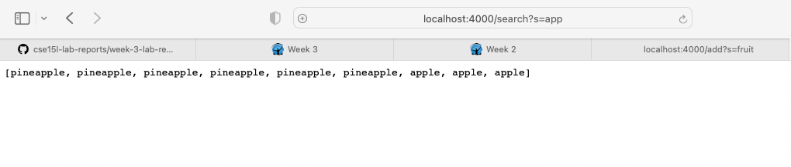

Part One: <br/>
Simple Search Engine Code: 

```
import java.io.IOException;
import java.net.URI;
import java.util.*; 

class Handler implements URLHandler {
    // The one bit of state on the server: a number that will be manipulated by
    // various requests.
    ArrayList<String> items = new ArrayList <String>(); 

    public String handleRequest(URI url) {
        System.out.println("Path: " + url.getPath());

        if(url.getPath().contains("/add")){ 
            String[] parameters = url.getQuery().split("=");
            items.add(0,parameters[1]);
            return parameters[1];
        } else if(url.getPath().contains("/search")){
            
            String[] parameters = url.getQuery().split("=");
            ArrayList<String> matchedWords = new ArrayList<String>(); 

            for(int i= 0; i<items.size();i++){
                if(items.get(i).contains(parameters[1])){
                    matchedWords.add(0,items.get(i));
                }
            } 
            return matchedWords.toString();    
        }
    return "404 Not Found!";
    }   
}


class NumberServer {
    public static void main(String[] args) throws IOException {
        if(args.length == 0){
            System.out.println("Missing port number! Try any number between 1024 to 49151");
            return;
        }

        int port = Integer.parseInt(args[0]);

        Server.start(port, new Handler());
    }
}
```


- Which methods in your code are called: The method handleRequest is being called in the code. 
- What the values of the relevant arguments to those methods are, and the values of any relevant fields of the class: The relevant argument to the method handleRequest is the url but more specifically the path `/add` and the query `?s=pineapple`.  The method is able to parse the url by `.getPath()` and more specifically the query by `.getQuery()`, it is further processed by `.split("=")`. Within the handleRequest method, there is an if statement checking what string is in the path and for this example the query is added into an ArrayList `items` .The method is able to find the string input by utilizing built-in functions such as `url.getPath().contains`.
- If those values change, how they change by the time the request is done processing: The values do not change unless I change value of the query or the path. 


- Which methods in your code are called: The method handleRequest is being called from the SearchEngine.java file.
- What the values of the relevant arguments to those methods are, and the values of any relevant fields of the class: The relevant argument to the method handleRequest is the url but more specifically the path `/add` and the query `?s=apple`. The method is able to parse the url by `.getPath()` and more specifically the query by `.getQuery()`, it is further processed by `.split("=")`. The method is able to find the string input by utilizing built-in functions such as `url.getPath().contains`. Within the handleRequest method, there is an if statement checking what string is in the path and for this example the query is added into an ArrayList `items`. 
- If those values change, how they change by the time the request is done processing: The values do not change unless I change value of the query or the path. 


- Which methods in your code are called: handleRequest is being called 
- What the values of the relevant arguments to those methods are, and the values of any relevant fields of the class: The relevant argument to the method handleRequest is the url but more specifically the path `/add` and the query `?s=fruit`. Within the handleRequest method, there is an if statement checking what string is in the path and for this example the query is added into an ArrayList `items`. The method is able to parse the url by `.getPath()` and more specifically the query by `.getQuery()`, it is further processed by `.split("=")`.The method is able to find the string input by utilizing built-in functions such as `url.getPath().contains`.   
- If those values change, how they change by the time the request is done processing: The values do not change unless I change value of the query or the path. 


- Which methods in your code are called: The method handleRequest is being called. 
- What the values of the relevant arguments to those methods are, and the values of any relevant fields of the class: the relevant argument is the url but more specifically the path `/search` and for my example the query `?s=app` searching for the subscript "app" in the list. The method is able to parse the url by `.getPath()` and more specifically the query by `.getQuery()`.The method is able to find the string input by utilizing built-in functions such as `url.getPath().contains`. In this example, after the string input is extracted by built-in function `.split` and added into Arraylist `matchedWords` , there is a for loop that checks the `items` with the string input and it will return the matched words. 
- If those values change, how they change by the time the request is done processing: The values that do not match will not be printed. 

2. Part Two 

Choose two of the bugs from different files above. <br/>
File: ArrayExamples.java <br/>
- The failure-inducing input (the code of the test): two index array <br/>
- The symptom (the failing test output): would print duplicate numbers. The last index would not update the first index. <br/>
- The bug (the code fix needed): the fix was to use a divide and conqueror approach. Also, I created a temp variable of type int to store the current value of the loop. <br/> 
- Then, explain the connection between the symptom and the bug. Why does the bug cause that particular symptom for that particular input?: the connection between the symptom and the bug is the last index was not stored anywhere therefore would not be reversed. The bug causes the particular symptom because it would not correctly index the last index. <br/>

- Failed Test Code: 
```
    //Changes the input array to be in reversed order
  static void reverseInPlace(int[] arr) {
    for(int i = 0; i < arr.length; i += 1) {
      arr[i] = arr[arr.length - i - 1];
    }
  }
  ```

- Successful Test Code: 
```
// Changes the input array to be in reversed order
  static void reverseInPlace(int[] arr) {
    for(int i = 0; i < arr.length / 2; i += 1) {
      int temp = arr[i];
      arr[i] = arr[arr.length - i - 1];
      arr[arr.length - i - 1] = temp; 

    }
  }
  ```
File: ListsExamples.java
- The failure-inducing input (the code of the test): any acceptable input would create a infinite loop <br/>
- The symptom (the failing test output): the symptom was an infinite loop <br/>
- The bug (the code fix needed): the code fix needed was to correctly update the index2 counter <br/> 
- Then, explain the connection between the symptom and the bug. Why does the bug cause that particular symptom for that particular input?: the connection between the symptom and the bug is the index was not correctly updated therefore would not be correct. The bug causes the particular symptom because it would not correctly update the index. <br/>

Failed Test Code: 
```
// Takes two sorted list of strings (so "a" appears before "b" and so on),
  // and return a new list that has all the strings in both list in sorted order.
  static List<String> merge(List<String> list1, List<String> list2) {
    List<String> result = new ArrayList<>();
    int index1 = 0, index2 = 0;
    while(index1 < list1.size() && index2 < list2.size()) {
      if(list1.get(index1).compareTo(list2.get(index2))<0){ //error is right ehre 
        result.add(list1.get(index1));
        index1 += 1;
      }
      else {
        result.add(list2.get(index2));
        index2 += 1;
      }
    }
    while(index1 < list1.size()) {
      result.add(list1.get(index1));
      index1 += 1;
    }
    while(index2 < list2.size()) {
      result.add(list2.get(index2));
      index1+=1;
    }
    return result;
  }

```

Successful Test Code:

```// Takes two sorted list of strings (so "a" appears before "b" and so on),
  // and return a new list that has all the strings in both list in sorted order.
  static List<String> merge(List<String> list1, List<String> list2) {
    List<String> result = new ArrayList<>();
    int index1 = 0, index2 = 0;
    while(index1 < list1.size() && index2 < list2.size()) {
      if(list1.get(index1).compareTo(list2.get(index2))<0){ //error is right ehre 
        result.add(list1.get(index1));
        index1 += 1;
      }
      else {
        result.add(list2.get(index2));
        index2 += 1;
      }
    }
    while(index1 < list1.size()) {
      result.add(list1.get(index1));
      index1 += 1;
    }
    while(index2 < list2.size()) {
      result.add(list2.get(index2));
      index2 += 1;
    }
    return result;
  }```
