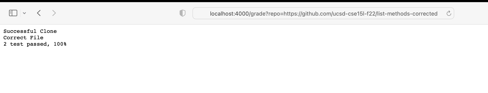
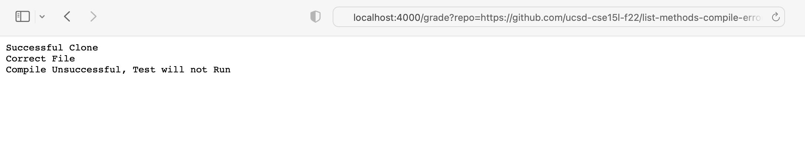
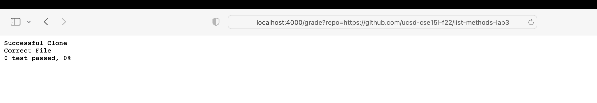

grade.sh code: 

```
# set -e means Exit immediately if a command exits with a non-zero status 
set -e

# deleting directory in case it exists
rm -rf student-submission

# git clone into directory called student-submission 
git clone $1 student-submission 2> cloneoutput.txt
echo 'Successful Clone'

# check if the correct file has been submitted 
# -e means if it exists or not 
if [[ -e student-submission/ListExamples.java ]]
then
    echo "Correct File"
else 
    echo "Incorrect file, test will not run, please resubmit correct file."
    exit 1
fi 

# copy updated ListExamples.java to parent directory 
cp student-submission/ListExamples.java ./ 

# turning off errors, so program will not quit if there is an error
set +e 

# shortcut
CPATH=".:lib/hamcrest-core-1.3.jar:lib/junit-4.13.2.jar" 

# compile test and redirecting stderr 
javac -cp $CPATH *.java 2> err1.txt  

# checking if compilation is successful 
if [ ! $? -eq 0 ]
then
    echo "Compile Unsuccessful, Test will not Run"
    exit 1
fi 

# Running Test and redirecting stdout to text file. 
java -cp $CPATH org.junit.runner.JUnitCore TestListExamples > finaloutput.txt 

# Reporting Grade based on JUnit Output 
if grep -w "OK" finaloutput.txt &>/dev/null
then
    echo "2 test passed, 100%"
elif grep "There were 2 failure" finaloutput.txt &>/dev/null
then
    echo "0 test passed, 0%"
elif grep "There were 1 failure" finaloutput.txt &>/dev/null 
then
    echo "1 test passed, 50%" 
fi
``` 

1. Student Submission: https://github.com/ucsd-cse15l-f22/list-methods-corrected 



2. Student Submission: https://github.com/ucsd-cse15l-f22/list-methods-compile-error 



3. Student Submission: https://github.com/ucsd-cse15l-f22/list-methods-lab3



Trace the Script for Compile Error:

```
set -e

rm -rf student-submission

# stdout: no output | stderr: Cloning into 'student-submission'... | return code: 0 
git clone $1 student-submission 2> cloneoutput.txt

echo 'Successful Clone'

# condition: true because the file ListExamples.java exists in the folder student-submission
if [[ -e student-submission/ListExamples.java ]]
then
    echo "Correct File"
else 
    echo "Incorrect file, test will not run, please resubmit correct file."
    exit 1
fi 

cp student-submission/ListExamples.java ./ 

set +e 

CPATH=".:lib/hamcrest-core-1.3.jar:lib/junit-4.13.2.jar" 

# stdout: no output | stderr: FILLIN | return code: non-zero 
javac -cp $CPATH *.java 2> err1.txt  

if [ ! $? -eq 0 ]
then
    echo "Compile Unsuccessful, Test will not Run"
    exit 1
fi 

java -cp $CPATH org.junit.runner.JUnitCore TestListExamples > finaloutput.txt 

if grep -w "OK" finaloutput.txt &>/dev/null
then
    echo "2 test passed, 100%"
elif grep "There were 2 failure" finaloutput.txt &>/dev/null
then
    echo "0 test passed, 0%"
elif grep "There were 1 failure" finaloutput.txt &>/dev/null 
then
    echo "1 test passed, 50%" 
fi
``` 
